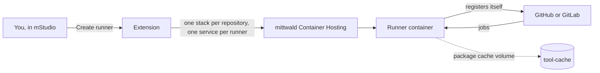

<p align="center">
  
</p>

<p align="center">
  <a href="https://github.com/Hermsi1337/mstudio-ci-runner-extension/actions/workflows/ci.yml"></a>
  <a href="https://github.com/Hermsi1337/mstudio-ci-runner-extension/releases"></a>
  <a href="https://github.com/Hermsi1337/mstudio-ci-runner-extension/pkgs/container/mstudio-ci-runner-github"></a>
  <a href="LICENSE"></a>
  <a href=".github/CONTRIBUTING.md"></a>
</p>

A [mittwald mStudio](https://studio.mittwald.de) extension that runs CI runners for
GitHub Actions and GitLab CI as container stacks in your mittwald project. Paste the
setup command from GitHub or GitLab, pick a size, done. The runner registers itself,
survives restarts and updates with one click.

## Why

Hosted runners are billed per minute and start cold. A runner in your own mittwald
project shares the resources you already pay for, keeps package caches between jobs
and reaches your databases and apps in the same project without a tunnel.

## Features

| | |
|---|---|
| **Two CI systems** | GitHub Actions (repository or organization) and GitLab CI (project, group or instance) |
| **Two ways to authenticate** | Paste the setup command with a registration token, or use a PAT and let the extension manage the registration |
| **Sizes and custom limits** | Small, medium, large, or your own CPU and memory limits |
| **Persistent package cache** | Optional volume for npm, pnpm, yarn, pip, Composer and Go with an hourly size trim |
| **Parallel jobs** | GitLab runners take several jobs at once, sized to the container |
| **Ephemeral runners** | One registration per job for GitHub (PAT mode) |
| **Lifecycle from mStudio** | Logs, restart, settings, update to the latest runner version, delete, all from the extension page |
| **English and German** | Follows the mStudio language |

## How it works



Runners of one repository, organization or GitLab instance share a container stack
in the project. Every runner is a service in it with the CPU and memory limits of its
size, a volume for its registration and work directory, and optionally a cache volume
plus a cronjob that keeps it below its limit. Deleting a runner removes its service
and volumes, the last one takes the stack with it, and where a token allows it, the
registration.

## Limitations

Container Hosting provides no Docker daemon. Plain jobs (Node, PHP, Python, Go,
Rust, Bash, deploys via SSH/rsync) work. GitHub `container:`, `services:`,
`docker build` and GitLab `image:`/`services:` do not.

## Quick start

For users: add the extension to your mStudio project and open "CI Runners".

For developers:

```bash
corepack enable && pnpm install
cp .env.example .env && pnpm run init:encryption
pnpm run dev:all
```

Continue with [docs/development.md](docs/development.md).

## Documentation

| Topic | File |
|---|---|
| Architecture, data flow, security | [docs/architecture.md](docs/architecture.md) |
| CI providers (GitHub, GitLab, adding new ones) | [docs/providers.md](docs/providers.md) |
| Becoming a contributor, registering the extension, tokens | [docs/mstudio-setup.md](docs/mstudio-setup.md) |
| Local development, environment variables, scripts | [docs/development.md](docs/development.md) |
| Generated code and specs | [docs/codegen.md](docs/codegen.md) |
| Tests | [docs/testing.md](docs/testing.md) |
| Runner images | [docs/runner-image.md](docs/runner-image.md) |
| Releases, images, CI, deployment | [docs/operations.md](docs/operations.md) |
| Languages (English, German) | [docs/i18n.md](docs/i18n.md) |
| UI style guide | [docs/styleguide.md](docs/styleguide.md) |
| Working rules for humans and agents | [AGENTS.md](AGENTS.md) |

Index of all pages: [docs/README.md](docs/README.md).

## Contributing

Issues and pull requests are welcome. Process in
[CONTRIBUTING.md](.github/CONTRIBUTING.md), working rules in [AGENTS.md](AGENTS.md),
UI rules in [docs/styleguide.md](docs/styleguide.md), security reports via
[SECURITY.md](.github/SECURITY.md).

## Origin

Structure and base stack come from the
[mittwald reference extension](https://github.com/mittwald/reference-extension).
The logo and banner live in [docs/assets/](docs/assets/); `logo.png` is the icon
registered in mStudio.

## License

MIT, see [LICENSE](LICENSE). Copyright (c) 2026 codeBoarder - Inh. Dennis Hermsmeier.
